[](https://classroom.github.com/online_ide?assignment_repo_id=8913306&assignment_repo_type=AssignmentRepo)
 
 # Pokemon-like RPG
 [Jordell Rodrigues](https://github.com/rjordell)
 [Kristin Chang](https://github.com/itskristnn)
 [Alessia Phang](https://github.com/aphan079)
 [Julian Ramos](https://github.com/jramo165)

## Project Description
 We all enjoy RPG games, and we wanted to make something Pokemon-inspired and fun since we all grew up with the series.
 We are planning only to use C++.
 Input will be text or characters and output will be text on the command line.
 Features include...
 -A short, linear story
 -Type advantages similar to Pokemon (water is strong against fire, etc.)
 -5 different monsters to collect, train, and battle with
 -naming your battle partner
 -naming your character
 -pokemon level system

## Class Diagram
 ```mermaid
classDiagram
    class Pokemon {
    Pokemon : -String ownerName
    Pokemon : -String name
    Pokemon : -Enum type
    Pokemon : -int experience
    Pokemon : -int health
    Pokemon : +attack(enemy) void
    Pokemon : +levelUp() void
    Pokemon : +addExp() void
    Pokemon : +changeHealth(int difference) void
    Pokemon : +setPokemonName() void
    Pokemon : +getPokemonName() void
    Pokemon : +displayInfo() void
}
    class Person {
    Person : -String name
    Person : -Vector~Pokemon~ team
    Person : +Person(string name)
    Person : +Person()
    Person : +Person()~
    Person : +setPersonName() void
    Person : +getPersonName() void
}
    class Player {
    Player : +catchPokemon() void
    Player : +addToTeam() void
    Player : +commandPokemon(Pokemon actionPokemon) void
}
    class NPC {
    NPC : +commandPokemon(Pokemon actionPokemon) void
    NPC : +startFight() void
}

Person<|--Player
Person<|--NPC
Pokemon "0..5" --> Player
Pokemon "0..5" --> NPC

```
The Pokemon class has various stats that can change as it is attacked, levels up, etc. The Player and NPC classes inherit from the Person class. Both players and NPCs can have up to 5 Pokemon on a team. Players can catch Pokemon and add them to the team. Both Players and NPCs can command Pokemon to perform moves. Pokemon can attack each other, gain experience, level up, lose and gain health, and have a custom name. Only NPCs can start battles with the player character.

 
 > ## Final deliverable
 > All group members will give a demo to the reader during lab time. ou should schedule your demo on Calendly with the same reader who took your second scrum meeting. The reader will check the demo and the project GitHub repository and ask a few questions to all the team members. 
 > Before the demo, you should do the following:
 > * Complete the sections below (i.e. Screenshots, Installation/Usage, Testing)
 > * Plan one more sprint (that you will not necessarily complete before the end of the quarter). Your In-progress and In-testing columns should be empty (you are not doing more work currently) but your TODO column should have a full sprint plan in it as you have done before. This should include any known bugs (there should be some) or new features you would like to add. These should appear as issues/cards on your Project board.
 > * Make sure your README file and Project board are up-to-date reflecting the current status of your project (e.g. any changes that you have made during the project such as changes to your class diagram). Previous versions should still be visible through your commit history. 
 
 ## Screenshots
>Installation

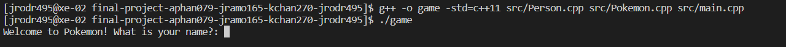

>Choose your name, choose your starter, then give nickname to your starter

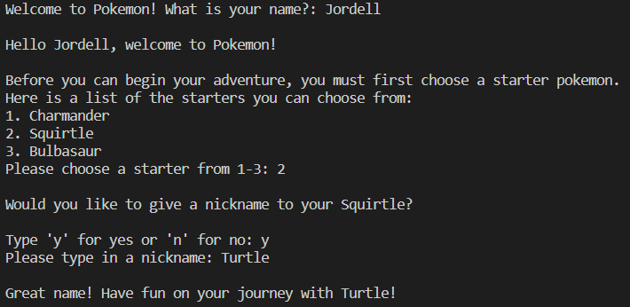

>Main menu for navigating the game with 6 options to choose from

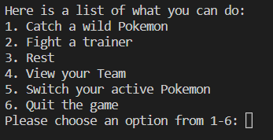

>Option 1 will catch wild pokemon until your party is full, then it gives experience to your active pokemon (underlined)

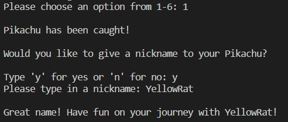

>Option 2 is the main storyline, user fights 3 non playable characters in order of ascending difficulty

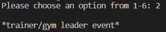

>Option 4 shows all the pokemon in your team and their stats

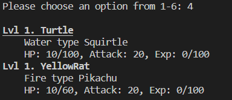

>Option 3 lets your pokemon rest to recover their health

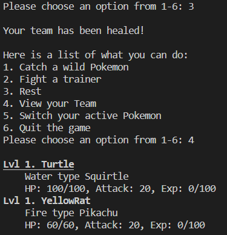

>Option 5 allows you to switch your active pokemon

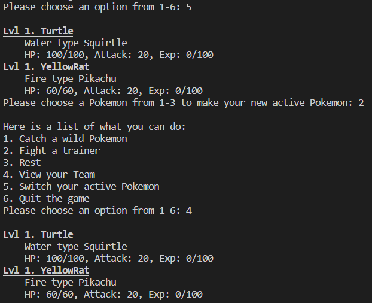

>Option 6 allows you to quit the game

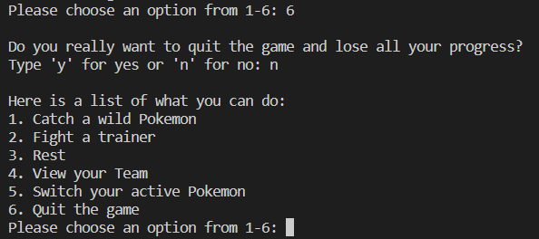

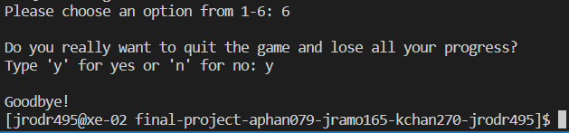

>Third Pokemon caught, team is full

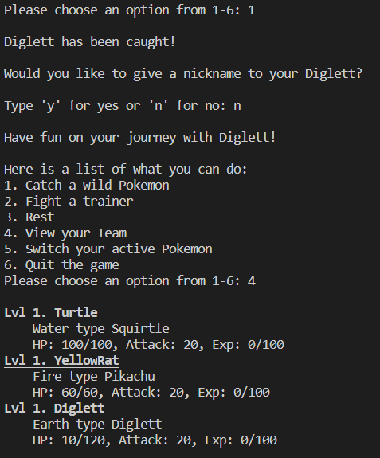

>Leveling/experience system. Second Pokemon got enough experience to level up to level 2, health and attack both increased.

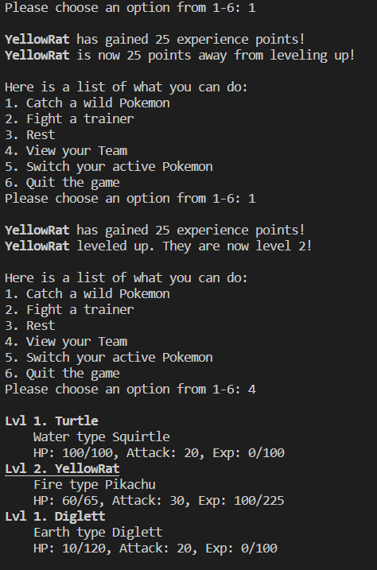


 ## Installation/Usage
 > Clone the respository
 ```
 $ git clone --recursive https://github.com/cs100/final-project-aphan079-jramo165-kchan270-jrodr495.git
 $ g++ -o game -std=c++11 src/Person.cpp src/Pokemon.cpp src/main.cpp
 $ ./game
 ```
 ## Testing
 > How was your project tested/validated? If you used CI, you should have a "build passing" badge in this README.
 
